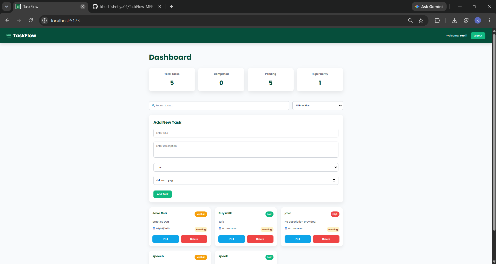

# TaskFlow – MERN Task Management Application

TaskFlow is a full-stack task management web application built using the MERN stack.

It allows users to securely register and log in, create and manage personal tasks, set priorities and due dates, search and filter tasks, and track task progress through a clean dashboard.

---

## 📸 Screenshots

### Dashboard

---

## ✨ Features

### 🔐 Authentication

- User registration
- User login
- Password hashing using bcrypt
- JWT-based authentication
- Protected routes
- User-specific task access
- Logout functionality

### 📝 Task Management

- Create new tasks
- View personal tasks
- View individual task details
- Edit existing tasks
- Delete tasks
- Set task priority
- Set task due dates
- Track completed and pending tasks

### 🔎 Search & Filtering

- Search tasks by title
- Filter tasks by priority
- Dynamic task filtering

### 📊 Dashboard

The dashboard provides an overview of:

- Total tasks
- Completed tasks
- Pending tasks
- High-priority tasks

### 🎨 User Interface

- Clean and responsive dashboard
- Task cards
- Priority indicators
- Status indicators
- Toast notifications
- Custom TaskFlow branding
- Custom TaskFlow favicon

---

## 🛠️ Tech Stack

### Frontend

- React.js
- React Router DOM
- JavaScript (ES6+)
- CSS3
- Axios
- React Toastify
- Vite

### Backend

- Node.js
- Express.js
- MongoDB
- Mongoose
- JSON Web Token (JWT)
- bcryptjs

### Development Tools

- Git
- GitHub
- VS Code
- Postman

---

## 🏗️ Project Structure

    TaskFlow-MERN/
    │
    ├── client/
    │   │
    │   ├── public/
    │   │   ├── taskflow-favicon.svg
    │   │   └── taskflow-dashboard.png
    │   │
    │   ├── src/
    │   │   │
    │   │   ├── components/
    │   │   │   ├── Navbar.jsx
    │   │   │   ├── PrivateRoute.jsx
    │   │   │   ├── TaskForm.jsx
    │   │   │   └── TaskList.jsx
    │   │   │
    │   │   ├── context/
    │   │   │   └── AuthContext.jsx
    │   │   │
    │   │   ├── pages/
    │   │   │   ├── Dashboard.jsx
    │   │   │   ├── Login.jsx
    │   │   │   └── Register.jsx
    │   │   │
    │   │   ├── services/
    │   │   │   └── api.js
    │   │   │
    │   │   ├── App.jsx
    │   │   ├── index.css
    │   │   └── main.jsx
    │   │
    │   ├── index.html
    │   ├── package.json
    │   └── vite.config.js
    │
    ├── server/
    │   │
    │   ├── config/
    │   │   └── db.js
    │   │
    │   ├── controllers/
    │   │   ├── authController.js
    │   │   └── taskController.js
    │   │
    │   ├── middleware/
    │   │   └── authMiddleware.js
    │   │
    │   ├── models/
    │   │   ├── User.js
    │   │   └── Task.js
    │   │
    │   ├── routes/
    │   │   ├── authRoutes.js
    │   │   └── taskRoutes.js
    │   │
    │   └── server.js
    │
    ├── .gitignore
    └── README.md

---

## 🔄 Application Flow

    User
      │
      ├── Register
      │      ↓
      │   Account Created
      │
      ├── Login
      │      ↓
      │   JWT Token Generated
      │      ↓
      │   Authenticated User
      │
      └── Dashboard
             │
             ├── Create Task
             ├── View Tasks
             ├── Search Tasks
             ├── Filter Tasks
             ├── Edit Task
             └── Delete Task

---

## 🔐 Authentication

TaskFlow uses JWT-based authentication to protect user-specific resources.

### Registration

1. User enters their name, email, and password.
2. Backend validates the submitted data.
3. Backend checks whether the email already exists.
4. Password is securely hashed using bcrypt.
5. The new user is stored in MongoDB.

### Login

1. User enters their email and password.
2. Backend searches for the user.
3. Password is verified using bcrypt.
4. A JWT token is generated.
5. The authenticated user can access protected task routes.

### Protected Routes

Protected API routes require a valid JWT token.

The token is sent using the Authorization header:

    Authorization: Bearer <token>

The authentication middleware verifies the token and identifies the logged-in user.

---

## 📋 API Endpoints

### Authentication

| Method | Endpoint             | Description         |
|--------|----------------------|---------------------|
| POST   | `/api/auth/register` | Register a new user |
| POST   | `/api/auth/login`    | Login user          |

### Tasks

| Method | Endpoint         | Description          |
|--------|------------------|----------------------|
| POST   | `/api/tasks`     | Create a task        |
| GET    | `/api/tasks`     | Get all user's tasks |
| GET    | `/api/tasks/:id` | Get a specific task  |
| PUT    | `/api/tasks/:id` | Update a task        |
| DELETE | `/api/tasks/:id` | Delete a task        |

All task endpoints are protected using JWT authentication.

---

## ⚙️ Installation & Setup

### 1. Clone the Repository

    git clone https://github.com/khushishetiya04/TaskFlow-MERN.git

Navigate into the project:

    cd TaskFlow-MERN

---

### 2. Backend Setup

Navigate to the server directory:

    cd server

Install dependencies:

    npm install

Create a `.env` file inside the `server` folder:

    PORT=5000
    MONGO_URI=your_mongodb_connection_string
    JWT_SECRET=your_jwt_secret

Start the backend server:

    npm run dev

---

### 3. Frontend Setup

Open another terminal.

Navigate to the client directory:

    cd client

Install dependencies:

    npm install

Start the React development server:

    npm run dev

The frontend will be available at:

    http://localhost:5173

---

## 🔑 Environment Variables

The backend requires the following environment variables:

| Variable     | Description                                       |
|--------------|---------------------------------------------------|
| `PORT`       | Port used by the Express server                   |
| `MONGO_URI`  | MongoDB connection string                         |
| `JWT_SECRET` | Secret key used to generate and verify JWT tokens |

Never commit your `.env` file or expose database credentials and JWT secrets publicly.

---

## 📌 Current Functionality

- ✅ User registration
- ✅ User login
- ✅ Password hashing
- ✅ JWT authentication
- ✅ Protected routes
- ✅ User-specific tasks
- ✅ Create task
- ✅ View tasks
- ✅ Edit task
- ✅ Delete task
- ✅ Search tasks
- ✅ Filter tasks by priority
- ✅ Task statistics
- ✅ Task priority
- ✅ Task due dates
- ✅ Toast notifications
- ✅ Responsive UI
- ✅ Custom TaskFlow branding
- ✅ Custom favicon
- ✅ Automatic login after registration

---

## 🔮 Future Improvements

- [ ] Custom delete confirmation modal
- [ ] Task completion toggle
- [ ] Pagination for large task lists
- [ ] Task sorting by due date and priority
- [ ] Improved form validation
- [ ] Improved mobile responsiveness
- [ ] Dark mode
- [ ] User profile management
- [ ] Application deployment

---

## 📚 What I Learned

Building TaskFlow helped me strengthen my understanding of full-stack web development and the MERN stack.

Key concepts practiced:

- Building REST APIs
- React component architecture
- React state management
- React Router
- Express.js middleware
- MongoDB and Mongoose
- CRUD operations
- JWT authentication
- Password hashing with bcrypt
- Protected routes
- Axios API integration
- Search and filtering
- Form handling
- Error handling
- Git and GitHub workflow
- Frontend and backend integration

---

## 👩‍💻 Author

### Khushi Paras Shetiya

**GitHub:**  
https://github.com/khushishetiya04

---

## ⭐ Project

TaskFlow was built as a full-stack MERN project to gain practical experience in frontend and backend development, authentication, database management, REST APIs, and CRUD-based application development.

If you like the project, consider giving the repository a ⭐.